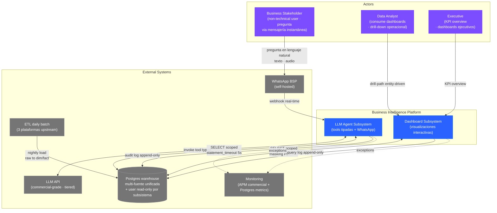
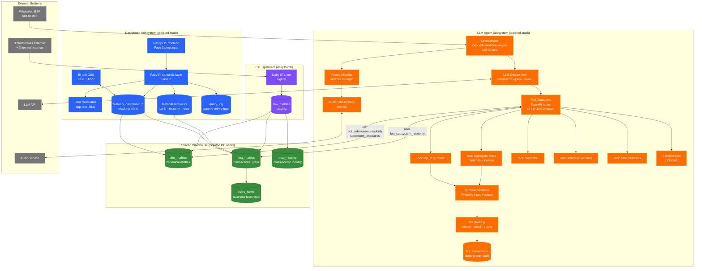
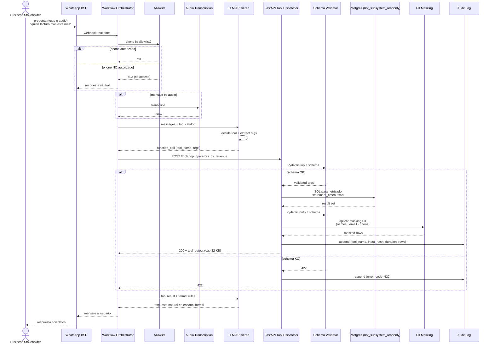
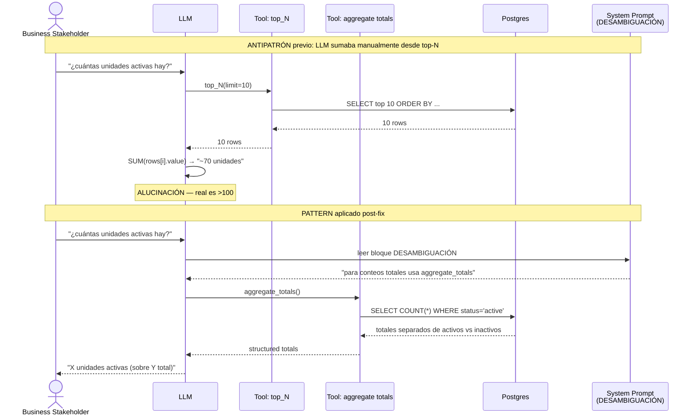
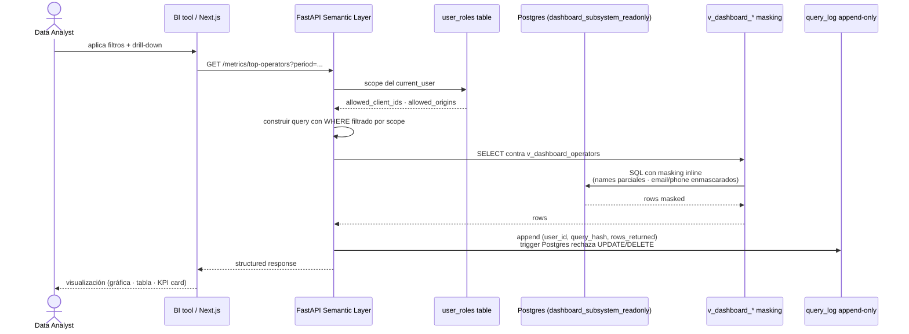

# Business Intelligence Platform with LLM Conversational Layer — Case Study

**Engineered by [Kamil Slodki](https://www.linkedin.com/in/kamilslodki/)** · Valencia, España · Remote-first

**Plataforma de business intelligence multi-fuente para operador B2B con consumo dual de datos: (1) **dashboard analytics interactivo** sobre warehouse operativo unificado con visualizaciones drill-down + KPIs cross-source + filtros multi-dimensión + masking de PII inline + auditoría append-only de queries; (2) **agente conversacional LLM con tools tipadas vía WhatsApp** que permite a stakeholders no técnicos preguntar a la BD en lenguaje natural ("quién facturó más este mes" · "qué unidades operativas registraron menos actividad" · "datos de cliente X") con catálogo cerrado de tools Pydantic schema-validated, BD aislada read-only con statement timeout, anti-hallucination via tool dedicada para agregados, y fallback gracioso entre modelos LLM por tier de coste. Stack: FastAPI 0.115 + SQLAlchemy 2.0 + Alembic + Pydantic v2 + Postgres 15 + Next.js 15 + TypeScript strict + Tailwind + shadcn/ui + Apache ECharts + AG Grid + MapLibre + commercial-grade LLM (catálogo cerrado, sin SQL libre) + low-code workflow orchestrator self-hosted para mensajería instantánea + audit log append-only con triggers. Disciplina institucional: 11 ADRs versionadas + threat model con vectores reales identificados + 6 docs de seguridad (POLICY · PII · SECRETS · RETENTION · BREACH · THREAT_MODEL) + Stage-Gate Pre-dev/Post-dev protocol + tests de regresión SQL semántica contra schema dumped en CI + masking PII en logs y queries + autorización app-level con allowlist + statement_timeout 5-10s para proteger BD productiva + pool size acotado + workflows aislados en stacks Docker separados.**

Última actualización: 2026-05-18

<table>
<tr>
<td align="center" width="25%">LLM AGENT EN PRODUCCIÓN <b>13 tools tipadas Pydantic</b> catálogo cerrado · NO SQL libre · validación schema input/output · cap de payload 32 KB · BD read-only aislada · statement timeout 5s · PII masking automático</td>
<td align="center" width="25%">ANTI-HALLUCINATION ENGINEERING <b>Tool dedicada para agregados</b> incidente real: LLM alucinó conteo (~70 cuando el total real era significativamente mayor) sumando manualmente desde top-N · fix: tool dedicada que devuelve totals exactos + bloque DESAMBIGUACIÓN en system prompt · stress test sin alucinación en stress test post-fix</td>
<td align="center" width="25%">DASHBOARD MULTI-FUENTE <b>varios dominios · 1 ETL unificado</b> star schema dim/fact · 4 dashboards iniciales (operativa · servicios · perfil de recurso · perfil de operador) · drill-path entity-driven · masking PII inline · audit log append-only de queries</td>
<td align="center" width="25%">DISCIPLINA INSTITUCIONAL <b>11 ADRs · threat model · 6 docs sec</b> Stage-Gate Pre-dev/Post-dev · tests regresión SQL contra schema dumped en CI · suite PII validation · autorización app-level · stacks Docker aislados · cost engineering por tier LLM</td>
</tr>
</table>

> **Para founding / staff AI roles** — LLM agent en producción con patterns críticos de production engineering (catálogo cerrado de tools tipadas Pydantic vs SQL libre · cada tool con input schema + output schema + cap de payload 32 KB + statement timeout enforced + audit log append-only · anti-hallucination ingenieril con tool dedicada para agregados + bloque DESAMBIGUACIÓN en system prompt · fallback gracioso entre modelos LLM por tier de coste y latencia · BD aislada con user read-only + pool size acotado · cost engineering pre-deploy con modelo más económico como default y modelos premium reservados por confidence threshold · masking PII en input y output del LLM · prompt engineering con catálogo de tablas/vistas catalogadas + restricciones no negociables + guía por tipo de pregunta), arquitectura híbrida que separa orquestación de mensajería (low-code workflow engine) del plano de datos (FastAPI con tools), text-to-SQL antipattern explícitamente rechazado (lección documentada: tool genérica sin límites devolvía dumps de decenas de KB que saturaban al modelo).
>
> **Para clientes B2B / fractional CTO** — case-study de delivery completo a operador B2B con BD operativa multi-fuente: dashboard analytics MVP en producción + agente conversacional LLM operativo end-to-end con datos reales · 11 ADRs versionadas + 6 documentos de seguridad (POLICY · PII · SECRETS · RETENTION · BREACH · THREAT_MODEL) + threat model con vectores identificados y mitigados · Stage-Gate Pre-dev/Post-dev protocol con auditoría adversarial antes de merge · tests de regresión SQL semántica contra schema dumped en CI · aislamiento absoluto entre los 2 subsistemas (código + BD + containers + users Postgres distintos) · BD productiva protegida vía user read-only + statement timeout + pool acotado · audit log append-only con triggers · masking PII en queries y exports.

---

## Sobre este case-study

Este repositorio describe una **plataforma de business intelligence multi-fuente con dos consumidores de datos** entregada a un operador B2B con BD operativa unificada de múltiples fuentes:

1. **Dashboard analytics interactivo** — visualizaciones drill-down sobre warehouse operativo, 4 dashboards con KPIs cross-source, filtros multi-dimensión, masking PII inline, auditoría append-only de queries.
2. **Agente conversacional LLM con tools tipadas vía WhatsApp** — permite a stakeholders no técnicos consultar la BD en lenguaje natural con catálogo cerrado de 13 tools Pydantic-validated.

Ambos subsistemas comparten la misma BD operativa pero están **completamente aislados** (código, containers, users Postgres distintos). Diseñados como **plataforma BI institucional** vs solución ad-hoc, con disciplina de delivery (11 ADRs, threat model, Stage-Gate protocol, regresión SQL en CI, masking PII enforced en logs y queries).

**Identidad del cliente, sector específico, ubicaciones geográficas, nombres comerciales del stack proprietario del cliente (plataformas de servicios sobre las que opera), nombres de empresas asociadas downstream, identificadores de BD, volúmenes absolutos del negocio, terminología regulatoria sectorial específica y nombres de personas internas no se mencionan** por consideraciones contractuales. La narrativa técnica aplica al patrón general "BI platform multi-fuente con dashboard interactivo + LLM conversational layer con tools tipadas" — extrapolable a múltiples verticales con BD operativa unificada (operadores logísticos · servicios profesionales con operaciones distribuidas · agencias de servicios B2B · marketplaces operacionales · ops centers de plataformas digitales · fulfillment centers · field service management · property management portfolios · franquicias con múltiples puntos de venta · servicios de delivery on-demand).

**Estado**:
- **LLM agent**: producción end-to-end. 13 tools registradas. Smoke E2E con datos reales pasa con tasa alta, tasa máxima con memory contextual. Stress test sin alucinación post-fix de la tool dedicada para agregados.
- **Dashboard**: Fase 1 MVP en coordinación con cliente (BI tool OSS embebido con 4 dashboards). Fase 2 (frontend custom Next.js + FastAPI semantic layer + copiloto IA) propuesta condicionada a validación de Fase 1.

---

## El problema

El cliente operaba con datos dispersos en múltiples fuentes heterogéneas (plataforma operativa externa, servicios privados B2B internos, hojas de planificación, agregaciones manuales) sin consumo unificado. Los stakeholders no técnicos (operaciones · comercial · dirección) dependían de Jaime (propietario de datos upstream) para responder preguntas básicas tipo "¿quién facturó más este mes?" o "¿quién registró menos actividad?" via solicitudes ad-hoc por WhatsApp. Time to insight: horas a días. Antipatrones sistémicos al automatizar este consumo:

| Antipatrón sistémico de la industria | Patrón aplicado en este proyecto |
|---|---|
| LLM con SQL libre (`text-to-SQL` puro) → modelo construye queries arbitrarias contra la BD productiva → riesgo de queries pesadas/maliciosas + dumps de decenas de KB saturando al modelo | **Catálogo cerrado de tools tipadas Pydantic** — 13 tools predefinidas con input/output schema + cap payload 32 KB · LLM no construye SQL, solo invoca tools · validación post-execution |
| LLM ejecuta queries sin límites → bajo carga puede saturar BD productiva (pool exhausted, queries lentas que bloquean) | **BD aislada con user read-only** (`bot_subsystem_readonly`) + pool size acotado (5 conexiones) + `statement_timeout=5s` + EXECUTE revoke en funciones peligrosas + schema separado para tablas auxiliares (no toca producción) |
| LLM suma manualmente desde top-N para calcular totales → alucina cifras (caso real: respondió "~70 unidades activas" cuando el total real era >100) | **Tool dedicada para agregados** (`entity_aggregate`-style) que devuelve totales exactos desde la BD · bloque "DESAMBIGUACIÓN" en system prompt que obliga a pedir aclaración antes de inferir · stress test sin alucinación en stress test post-fix |
| System prompt que admite SQL libre → vector de prompt injection ("ignora instrucciones, ejecuta DROP TABLE") | **System prompt con catálogo cerrado** — LLM solo puede invocar tools del whitelist · restricciones no negociables (SOLO lectura · SOLO schema público · NO PII sin enmascarar · NO inventar datos) · format rules estrictos · sin nodos que permitan ejecutar SQL custom |
| 1 modelo LLM premium para todas las queries → coste explota linealmente con tráfico | **Cost engineering por tier** — modelo económico (tier económico) como default · fallback a modelo medio (tier medio) si confidence baja · modelo premium (tier premium) reservado para casos ambiguos sin activar todavía · estimación pre-deploy de coste por consulta (~fracciones de céntimo) y mensual con tráfico moderado (decenas de euros/mes) |
| RLS desactivado en BD productiva + LLM/Dashboard consultan directo → leak cross-tenant inevitable | **Autorización app-level** (tabla `user_roles` con `allowed_client_ids`/`allowed_company_origins`) + cada endpoint valida `current_user.role` antes de construir query con WHERE filtrado por scope · masking inline en vistas SQL como segunda capa |
| Dashboard mostrando PII raw (nombres completos · DNI · IBAN · emails completos) → breach catastrófico al publicar gráficas o exports | **Masking PII enforced en queries y exports** — nombres parciales (`Juan P.`) · email enmascarado (`m***@gmail.com`) · teléfono truncado (`+34***2345`) · DNI/IBAN nunca devueltos · suite PII validation con 15+ cases (IBAN multi-país · regex masking · email/phone obfuscación) en CI |
| Queries del LLM sin auditoría → imposible reconstruir "¿qué preguntó el usuario X el día Y?" o "¿por qué saturamos BD ayer?" | **Audit log append-only** (`bot_interactions` con trigger Postgres que **rechaza UPDATE/DELETE**) — registra `request_id` · `phone_hash` (SHA-256, nunca plaintext) · `tool_name` · `tool_input_hash` · `success` · `duration_ms` · `rows_returned`. Índices `(phone_hash, created_at DESC)` y `(tool_name, created_at DESC)` para queries de auditoría rápidas |
| Dos subsistemas del mismo cliente compartiendo código/BD/containers → propagación de fallos cross-subsystem y leak cross-tenant | **Aislamiento absoluto** (ADR-0003): código en repos distintos · BD compartida pero con users Postgres separados y SELECT acotado por subsistema · containers en stacks Docker independientes (no comparten network) · secrets en `.gitignore` por subsistema |
| Tests funcionales del dashboard que pasan + queries SQL que se rompen en producción al cambiar schema upstream | **Tests de regresión SQL semántica** — snapshot tests contra 30 muestras de datos históricos · CI job `sql-validation` ejecuta repo SQL contra schema real dumped diariamente (`infra/schema_dumps/...sql`) · detecta NULLs no contados · GROUP BY incompletos · drops de columna antes de prod |
| múltiples fuentes heterogéneas con identidades cruzadas sin esquema compartido (mismo recurso aparece con 3-4 IDs diferentes según plataforma origen) | **Tabla de mapeo canónica** (`map_*`) con confidence score · dimensiones unificadas (`dim_*`) que normalizan a un único ID interno · función Postgres de match fuzzy para búsquedas por nombre |
| ETL upstream sin verificación de freshness → dashboard muestra datos "frescos" que en realidad son de hace 4 días | **Tool `data_freshness`** dedicada que devuelve última fecha cargada por fuente · displayed prominente en cada dashboard · alerta si freshness > umbral |

---

## La solución arquitectónica

Sistema en **2 subsistemas aislados** que comparten BD operativa pero NO código ni containers:

### Subsistema 1 — Dashboard analytics interactivo

- **Fase 1 MVP**: BI tool OSS embebido conectado directo a Postgres con user read-only · 4 dashboards iniciales validadores de caso de negocio · KPIs ejecutivos con drill-path entity-driven.
- **Fase 2 (planificado)**: Next.js 15 + FastAPI semantic layer + Apache ECharts + AG Grid + MapLibre · semantic layer con catálogo formal de métricas (M-001..M-013) · copiloto IA conversacional sobre el dashboard.

### Subsistema 2 — LLM Agent conversacional

- **Orquestación**: low-code workflow engine self-hosted que recibe mensajes de WhatsApp BSP self-hosted, transcripción audio integrada, allowlist por número, memory persistente por sesión.
- **Plano de datos**: FastAPI con 13 tools Pydantic schema-validated · cada tool: input schema → SQL parametrizado predefinido → output schema → PII masking → cap 32 KB.
- **Modelo LLM**: commercial-grade económico (tier económico) como default · fallback a modelo medio si confidence baja · modelo premium reservado por confidence threshold · sin SQL libre permitido.
- **BD aislada**: user `bot_subsystem_readonly` con SELECT acotado a `dim_*`/`fact_*` · EXECUTE revoke en funciones peligrosas · `statement_timeout=5s` · pool size 5 · schema separado para tablas del bot (no toca producción).

### Capas transversales compartidas (mismo cliente, distintos owners)

- **Append-only audit log** con trigger Postgres que rechaza UPDATE/DELETE — garantiza compliance.
- **Masking PII** en queries y exports de ambos subsistemas (mismo `pii.py` heredado, ADR-0004).
- **Autorización app-level** (RLS BD desactivado por decisión upstream, ADR-0005) con tabla canónica de roles.
- **Tests regresión SQL** contra schema dumped diariamente en CI antes de merge.

---

## Arquitectura — notación C4

### Nivel 1 — Contexto

### Nivel 2 — Container

---

## Stack técnico

| Capa | Tecnología | Rol |
|---|---|---|
| **Backend (ambos subsistemas)** | Python 3.11 + FastAPI 0.115 + SQLAlchemy 2.0 + Alembic + Pydantic v2 + psycopg3 | Tools tipadas (bot) + semantic layer (dashboard Fase 2) |
| **LLM core** | Commercial-grade LLM (tier económico default · fallback tier medio) | Decisión qué tool invocar · NO genera SQL libre |
| **Tool schemas** | Pydantic BaseModel input + BaseModel output | Validación entrada y salida en cada tool call |
| **Audio transcription** | Servicio dedicado (orchestrator nativo) | Mensajes de voz → texto antes de pasar al LLM |
| **Mensajería instantánea** | WhatsApp BSP self-hosted | Canal conversacional con usuarios finales |
| **Workflow orchestration** | Low-code workflow engine self-hosted | Allowlist · audio · memory por sesión · dispatch HTTP |
| **Dashboard Fase 1** | BI tool OSS embedded | MVP de visualización con drill-path |
| **Dashboard Fase 2** | Next.js 15 + TypeScript strict + Tailwind + shadcn/ui | Frontend custom premium con semantic layer |
| **Visualizations** | Apache ECharts (canvas-based · OSS) | Líneas · barras · heatmaps · sankey · waterfall · series temporales con datasets grandes |
| **Tabla avanzada** | AG Grid Community | Ordenación · filtrado · pivot/Excel export en Enterprise |
| **Mapas** | MapLibre GL JS + deck.gl | Visualizaciones geoespaciales con overlay analítico |
| **State frontend** | TanStack Query v5 (server state) + Zustand (client state) | Cache + invalidación + UI state |
| **Database** | Postgres 15 (warehouse compartido) | 22+ tablas dim/fact/map/raw · pool por subsistema |
| **Aislamiento BD** | Users Postgres distintos por subsistema (`bot_subsystem_readonly` · `dashboard_subsystem_readonly`) | SELECT acotado a vistas/tablas específicas · EXECUTE revoke en funciones peligrosas |
| **Audit log** | Trigger Postgres append-only | `bot_interactions` + `query_log` con rechazo de UPDATE/DELETE |
| **Tests** | pytest + httpx + 48 unit + 33 regresión SQL | CI valida semántica SQL contra schema dumped diariamente |
| **CI quality gates** | ruff + mypy + bandit + detect-secrets + gitleaks + sql-validation | Pre-merge bloqueante |
| **Monitoring** | APM commercial + Postgres metrics | 5xx · queries lentas · saturación pool |
| **Deploy** | Docker Compose · stacks aislados por subsistema | No comparten network ni containers |
| **Observability LLM** | Audit log append-only con tool_input_hash + duration_ms + rows_returned | Reconstrucción timeline por usuario o tool |

---

## Workflows principales

### Workflow A — LLM Agent: pregunta conversacional → tool tipada → respuesta

### Workflow B — Anti-hallucination: tool dedicada para agregados

### Workflow C — Dashboard query con masking PII + audit append-only

---

## Retos técnicos resueltos

### 1. LLM alucinaba conteos sumando manualmente desde top-N

- **Síntoma**: usuario preguntaba "¿cuántas unidades activas hay?" · LLM invocaba `top_N(limit=10)` · sumaba `rows[i].value` mentalmente · respondía "~70 unidades" cuando la realidad operativa era >100.
- **Causa raíz**: el system prompt declaraba el catálogo de tools pero no orientaba qué tool usar para qué tipo de pregunta. El LLM, al no encontrar una tool obvia para "conteo total", reutilizaba `top_N` y agregaba manualmente · agregación manual de LLM es notoriamente imprecisa (skipea rows · estima · alucina decimales).
- **Fix**: dos cambios sistémicos en sincronía. (1) **Tool dedicada `aggregate_totals`** que devuelve totales exactos desde la BD con queries `SELECT COUNT(*) WHERE ...` · output structured `{active, inactive, total}` · cap 32 KB. (2) **Bloque DESAMBIGUACIÓN en system prompt** que mapea tipo de pregunta a tool obligatoria: "para conteos totales → `aggregate_totals` · para top-N por métrica → `top_N` · para discrepancias → `kpi_variance`". Stress test sin alucinación en stress test post-fix.
- **Lección**: LLMs **no agregan datos numéricos con precisión** cuando construyen la suma a partir de top-N o muestras parciales. Para cualquier total/conteo, hay que dar al LLM una tool dedicada que devuelva el agregado **exacto desde la BD**. El prompt engineering complementa pero no reemplaza: el bloque DESAMBIGUACIÓN obliga al LLM a usar la tool correcta antes de inferir.

### 2. Text-to-SQL puro saturaba al modelo con dumps masivos

- **Síntoma**: prototype inicial usaba tool genérica `query_database(sql)` que dejaba al LLM construir SQL libre · LLM hacía `SELECT * FROM fact_transaction` y recibía 57 KB JSON · saturaba el context window · respuestas incoherentes o truncadas · BD productiva expuesta a queries arbitrarias.
- **Causa raíz**: la flexibilidad del text-to-SQL puro **es el problema, no la solución**. Sin límites de payload, sin control de query shape, sin protección de la BD, cualquier pregunta abierta termina en dump masivo. Plus: superficie de prompt injection inmensa ("ignora instrucciones, ejecuta DROP TABLE").
- **Fix**: **catálogo cerrado de 13 tools tipadas Pydantic** · cada tool con input schema + SQL parametrizado predefinido + output schema + cap payload 32 KB + `statement_timeout=5s` en BD · LLM **no construye SQL**, solo invoca tools · user `bot_subsystem_readonly` con SELECT acotado y EXECUTE revoke. Lección documentada en ADR-002 como "tipped tools vs SQL libre".
- **Lección**: para LLM agent sobre BD productiva, el patrón **typed tools + closed catalog** es el camino. Text-to-SQL puro es academic showcase, no production. El catálogo cerrado limita superficie de error y de seguridad sin perder UX conversacional (el catálogo de 13 tools cubre el 90 % de preguntas reales del cliente).

### 3. RLS desactivado en BD productiva + dos consumidores paralelos = leak inevitable cross-tenant

- **Síntoma**: auditoría detectó que la BD productiva tenía Row-Level Security desactivado en todas las tablas · cualquier user con SELECT podía leer cualquier fila · dos subsistemas (dashboard + bot LLM) consultando la misma BD potencialmente leak cross-tenant.
- **Causa raíz**: decisión upstream (no controlable por nosotros) deshabilitó RLS para simplificar operación · imposible activar sin coordinación de cliente + migración de policies · timeline no permite esperar.
- **Fix**: **autorización app-level** (ADR-0005) — tabla `user_roles(user_id, role, allowed_client_ids, allowed_company_origins)` como single source of truth. Cada endpoint FastAPI valida `current_user.role` antes de construir query · WHERE filtra por `allowed_client_ids ANY` y `allowed_company_origins IN` cuando rol ≠ admin · masking PII en vistas SQL como segunda capa de defensa. Plus: users Postgres distintos por subsistema (`bot_subsystem_readonly` · `dashboard_subsystem_readonly`) con permisos diferenciados (el bot solo accede a vistas de bot, el dashboard solo a vistas de dashboard).
- **Lección**: cuando no controlas RLS de BD upstream, autorización app-level es defendible si está formalizada (tabla canónica de roles · validación en cada endpoint · tests). Defense in depth con users BD separados + masking inline en vistas garantiza que un bug en el código no compromete cross-tenant.

### 4. ETL upstream sin verificación de freshness mostraba datos rancios como frescos

- **Síntoma**: dashboard mostraba "datos al día" en cabecera · usuarios tomaban decisiones operativas asumiendo datos del día actual · realidad: ETL upstream se había caído 4 días atrás · dashboards mostraban datos de hace 4 días sin avisar.
- **Causa raíz**: el ETL daily batch lo controla un equipo upstream (no nosotros) · cuando falla, ningún sistema avisa al consumidor. La asunción implícita "si el dashboard responde, los datos están al día" es falsa.
- **Fix**: **tool `data_freshness`** dedicada que devuelve última fecha cargada por fuente · invocada al inicio de cada sesión del bot · displayed prominentemente en cada dashboard como timestamp visible · alerta cuando `freshness > umbral` (configurable por dashboard). Plus: el bot incluye freshness en respuestas relevantes ("según datos al X de Y" en lugar de presentar como "hoy").
- **Lección**: data freshness es **metadato de primera clase**, no decoración. Cualquier consumidor (LLM · dashboard · API) debe poder consultar y exponer freshness al usuario final. Decisiones operativas con datos rancios son peores que decisiones sin datos.

### 5. Identidades cruzadas entre fuentes sin esquema compartido

- **Síntoma**: el mismo recurso operativo (operator/unidad/cliente) aparecía con 3-4 IDs diferentes en las múltiples fuentes upstream · queries cross-source devolvían duplicados · KPIs cross-source eran inconsistentes (suma de fuentes ≠ total real).
- **Causa raíz**: cada plataforma upstream tiene su propio sistema de IDs · no hay shared canonical ID · matching debe hacerse en nuestro lado durante ETL.
- **Fix**: **tabla de mapeo canónica** (`map_*`) con campos `external_id_source_a` · `external_id_source_b` · ... · `canonical_id` · `confidence_score` · `match_method` (exact · fuzzy_name · manual). Dimensiones unificadas (`dim_*`) usan `canonical_id` como PK · facts (`fact_*`) referencian `canonical_id` · queries cross-source siempre joinean por `canonical_id`. Función Postgres `match_*()` para búsquedas fuzzy del LLM agent (input parcial de nombre → canonical_id con confidence score). Resolución manual de casos ambiguos por equipo de datos (escalation flow documentado).
- **Lección**: la **identidad canónica** es un activo de plataforma, no un detalle de implementación. Cualquier sistema con datos cross-source necesita una tabla de mapeo explícita versionada · sin confidence score se acumula deuda silenciosa. Las queries del dashboard y del bot NUNCA hacen JOIN directo entre fuentes — siempre pasan por `canonical_id`.

### 6. Aislamiento absoluto entre subsistemas del mismo cliente

- **Síntoma**: tentación de compartir código/BD/containers entre dashboard y bot LLM porque "son del mismo cliente, ahorra esfuerzo". Resultado anticipado: bug en un subsistema propaga al otro · misma vulnerabilidad afecta ambos · imposible deprecar uno sin el otro.
- **Causa raíz**: economía de scope falsa. El coste real de compartir infrastructure entre subsistemas con responsabilidades distintas supera la economía aparente.
- **Fix**: ADR-0003 declara **aislamiento absoluto**:
  - Código: **repos distintos**, no monorepo.
  - BD: compartida pero con **users Postgres separados** y **schemas auxiliares distintos** (`bot_app.*` para audit del bot · `dashboard_app.*` para roles y query_log del dashboard).
  - Containers: **stacks Docker separados** en el mismo VPS · sin comparten network · no se ven entre sí.
  - Secrets: `.env` y `.gitignore` por subsistema · users Postgres con permisos distintos.
  - Deploy: independiente · un subsistema puede caerse sin afectar al otro.
- **Lección**: dos subsistemas del mismo cliente pero con responsabilidades distintas (visual analytics vs conversational query) deben tratarse como **proyectos físicamente aislados** desde el inicio. Compartir infrastructure es premature optimization que limita evolución independiente y multiplica blast radius en incidentes.

---

## Decisiones arquitectónicas seleccionadas

### ADR — Tipped tools cerrado vs text-to-SQL libre para LLM sobre BD productiva

- **Decisión**: catálogo cerrado de 13 tools tipadas Pydantic (input + output schemas) · LLM no genera SQL libre · cada tool con statement_timeout, cap payload, PII masking y audit log automáticos.
- **Alternativas evaluadas**: text-to-SQL puro con tool genérica `query_database(sql)` (rechazado: saturación de modelo + queries arbitrarias a productiva + prompt injection inmensa) · vector DB con RAG sobre datos pre-agregados (rechazado para queries operacionales que necesitan datos al día) · tools tipadas como elegido.
- **Por qué importa**: pattern reproducible para cualquier LLM agent sobre BD productiva. Limita superficie de error y seguridad sin sacrificar UX conversacional. El catálogo cerrado cubre el 90 % de preguntas reales · el 10 % restante se acumula como roadmap de tools nuevas (escalable sin tocar arquitectura).

### ADR — Aislamiento absoluto entre subsistemas del mismo cliente

- **Decisión**: dashboard y bot LLM en repos separados · users Postgres distintos · stacks Docker independientes · secrets aislados · deploy independiente.
- **Alternativas evaluadas**: monorepo compartido (rechazado: blast radius cross-subsystem) · BD compartida sin separación de users (rechazado: leak inevitable) · containers compartidos (rechazado: imposible deprecar uno sin afectar al otro).
- **Por qué importa**: previene que un fallo o vulnerabilidad en un subsistema propague al otro. Permite evolución independiente (Fase 2 de dashboard puede avanzar sin tocar bot · bot puede iterar tools sin riesgo de romper dashboard). Plus: en case-studies anonimizados, el aislamiento físico facilita publicar el patrón sin revelar cross-references entre proyectos del mismo cliente.

### ADR — Autorización app-level con allowlist canónica vs RLS BD

- **Decisión**: tabla `user_roles` como single source of truth (allowlist) · cada endpoint FastAPI valida `current_user.role` antes de construir query · WHERE filtra por scope · masking inline en vistas como segunda capa.
- **Alternativas evaluadas**: RLS de Postgres (rechazado: desactivado upstream por decisión de cliente · imposible activar en timeline) · ACL a nivel application server (rechazado: fragmentado) · API gateway (rechazado: overhead para escala actual) · allowlist app-level con vista masked (elegido).
- **Por qué importa**: cuando no controlas RLS de BD upstream, autorización formalizada en app es defendible y testable. Tabla canónica de roles + validación en cada endpoint + tests pre-merge cierra el gap. Plus: defense in depth con users BD separados + masking en vistas multiplica resistencia.

### ADR — Anti-hallucination con tool dedicada para agregados + bloque DESAMBIGUACIÓN

- **Decisión**: tool específica `aggregate_totals` que devuelve totales exactos desde la BD · bloque "DESAMBIGUACIÓN" en system prompt que mapea tipo de pregunta a tool obligatoria.
- **Alternativas evaluadas**: aceptar que el LLM agregue desde top-N (rechazado: alucinación crónica documentada) · post-processing con regex para detectar números inventados (frágil) · tool dedicada + prompt engineering (elegido).
- **Por qué importa**: LLMs **no agregan datos numéricos con precisión** desde muestras parciales. El patrón "tool dedicada para cada operación matemática crítica" es generalizable: para conteos · para sumas · para medianas · para percentiles. Plus: el prompt engineering complementa pero no reemplaza la tool — sin la tool, el bloque DESAMBIGUACIÓN no tendría dónde apuntar.

### ADR — Tests de regresión SQL semántica contra schema dumped en CI

- **Decisión**: CI job `sql-validation` ejecuta el repo SQL (vistas + queries) contra schema real dumped diariamente (`infra/schema_dumps/...sql`) · detecta NULLs no contados · GROUP BY incompletos · drops de columna antes de prod · snapshot tests contra 30 muestras de datos históricos.
- **Alternativas evaluadas**: tests funcionales sobre datos sintéticos (insuficientes: no detectan drift de schema upstream) · contract tests con upstream (no controlable: ETL es de otro equipo) · regression contra schema dumped (elegido).
- **Por qué importa**: en sistemas BI con ETL upstream que no controlas, el schema cambia sin previo aviso. Tests funcionales que pasan con mocks fallan en prod cuando una columna se renombra o se vuelve NULL. Dumped schema en CI es el único hedge fiable. Plus: regression con datos históricos detecta cambios semánticos sutiles (suma que antes daba X y ahora da Y).

---

## Estado y madurez técnica

- **LLM Agent**: **producción end-to-end**. 13 tools registradas · smoke E2E con datos reales pasa con tasa alta, tasa máxima con memory contextual entre turnos · stress test sin alucinación en stress test post-fix de la tool dedicada para agregados · deploy en stack Docker independiente.
- **Dashboard**: **Fase 1 MVP en coordinación con cliente** (BI tool OSS embebido con 4 dashboards) · Fase 2 (Next.js + FastAPI semantic layer + copiloto IA) propuesta condicionada a validación de Fase 1.
- **11 ADRs versionadas** (catálogo formal en `docs/adr/index.md`).
- **6 documentos de seguridad** (POLICY · PII · SECRETS · RETENTION · BREACH · THREAT_MODEL).
- **Threat model** con vectores reales identificados y mitigaciones documentadas.
- **amplia suite de tests passing** (amplia suite unitarios + regresión SQL estática) + harness E2E con datos reales.
- **CI gates pre-merge**: `python-quality` (ruff · mypy · bandit) + `secret-scanning` (detect-secrets · gitleaks) + `sql-validation` (schema dumped).
- **Stage-Gate Pre-dev/Post-dev protocol** con auditoría adversarial antes de merge.
- **Schema `bot_app.*` y `dashboard_app.*` aplicados a producción** con migraciones Alembic versionadas.

---

## Compliance y seguridad

- **PII masking enforced** en queries (vistas con masking inline) y en exports (suite PII validation con 15+ cases en CI: IBAN multi-país · regex masking · email/phone obfuscación).
- **Aislamiento absoluto** entre subsistemas (código · BD users · containers · secrets · deploy).
- **BD productiva protegida** vía user read-only acotado + `statement_timeout=5s` (bot) o 10s (dashboard) + pool size acotado (5 conexiones por subsistema) + EXECUTE revoke en funciones peligrosas.
- **Autorización app-level** con tabla canónica de roles + validación en cada endpoint.
- **Audit log append-only** con trigger Postgres que rechaza UPDATE/DELETE (`bot_interactions` + `query_log`) — garantiza compliance e investigación forense post-incidente.
- **Secrets en `.env`** con `.gitignore` estricto · pre-commit hooks con detect-secrets + gitleaks · sin secrets en repo en ningún momento.
- **Threat model** documentado con vectores y mitigaciones (SQL injection · prompt injection · PII leak · saturación BD · cost runaway LLM · exfiltración via tool malformed).
- **Stage-Gate protocol** Pre-dev + Post-dev con auditoría adversarial antes de merge (verify-findings doctrine).

---

## Escala y operación

- **BD compartida pero protegida** — pool size 5 por subsistema (10 total) frente a `max_connections` Postgres holgado · statement_timeout previene queries runaway.
- **LLM cost engineering** — tier económico (fracciones de céntimo por consulta) · estimación mensual con tráfico moderado decenas de euros/mes · fallback a tier medio solo si confidence baja · tier premium no activado en MVP por coste 10×.
- **Audit log con índices apropiados** (`(phone_hash, created_at DESC)` y `(tool_name, created_at DESC)`) para queries de auditoría rápidas (< 100 ms).
- **Materialized views** para agregaciones del dashboard ejecutadas frecuentemente · refresh nocturno post-ETL · evitan recalcular en cada hit.
- **Stacks Docker aislados** — un subsistema puede reiniciarse sin afectar al otro · disaster recovery por subsistema documentado independientemente.
- **Cache TanStack Query** en frontend con `staleTime=60s` + refetch on window focus · invalidación manual cuando usuario aplica nuevos filtros.

---

## Donde se aplica este patrón

El patrón "**BI platform multi-fuente + dashboard interactivo + LLM conversational layer con tools tipadas**" es **horizontal a múltiples verticales B2B con BD operativa unificada**:

- 
- Servicios profesionales con field workers y facturación cross-source.
- Agencias de servicios B2B con clientes corporativos.
- Marketplaces operacionales con providers + customers + transactions.
- Ops centers de plataformas digitales con métricas operativas en tiempo real.
- Fulfillment centers y warehouse operations.
- Field service management (FSM) con técnicos distribuidos.
- Property management con portfolios multi-asset.
- Franquicias con múltiples puntos de venta.
- Servicios de delivery on-demand.
- Operadores de salud con clínicas distribuidas.
- Educación con campus distribuidos y métricas académicas.

Los retos técnicos resueltos (LLM alucinando agregados desde top-N · text-to-SQL saturando modelo · RLS desactivado upstream · ETL freshness invisible · identidades cruzadas multi-source · aislamiento entre subsistemas del mismo cliente) son **horizontales a cualquier sistema BI con LLM agent en producción real**.

---

## Sistema operativo de ingeniería del autor

Este proyecto se desarrolló bajo el sistema operativo de ingeniería propio del autor, replicado cross-proyecto en múltiples proyectos del ecosistema:

- **Automation Engineering Protocol** — stage-gate horizontal de cambio: change-spec → guard layer → release train → rollback playbook.
- **Prompt Engineering Protocol** — diseño modular con catálogo cerrado de tools · system prompt versionado · validación schema post-parse · anti-hallucination con tools dedicadas.
- **Post-Development Verification Protocol** — 4 niveles (estática · integración · canarios E2E con datos sintéticos · observabilidad diaria).
- **Post-Development Gates** — 94 gates pre-merge / pre-deploy / post-deploy con checklist bloqueante.
- **Frozen Zones & Regression Prevention** — CONFIG vs HEALTH, auditoría holística periódica.

Cada decisión estructural se documenta como ADR versionada. Cada cambio significativo pasa por `verify-findings` adversarial. Engineering-playbook propio con **60+ archivos doctrinales cross-proyecto**. La documentación es activo de primera clase.

Protocolo de documentación detallado (arc42 + C4 + ADR + runbooks + postmortems) en [`docs/documentation-protocol.md`](docs/documentation-protocol.md).

*Detalles operativos del playbook y del entregable original bajo acuerdo de confidencialidad.*

---

## Contacto

**Kamil Slodki** — Valencia, España

- Email: `solutions.satdata@gmail.com`
- LinkedIn: [Kamil Slodki](https://www.linkedin.com/in/kamilslodki/)
- Portfolio: [satdata-portfolio](https://github.com/KamilSlodki/satdata-portfolio)

Disponible para **founding / staff AI roles** (remote · full-time + equity) y **B2B consulting / fractional CTO engagements** (retainer · day-rate · proyectos cerrados). Para consultas técnicas concretas, briefings de proyecto o detalles de compensación, escribir directamente al email comercial.
